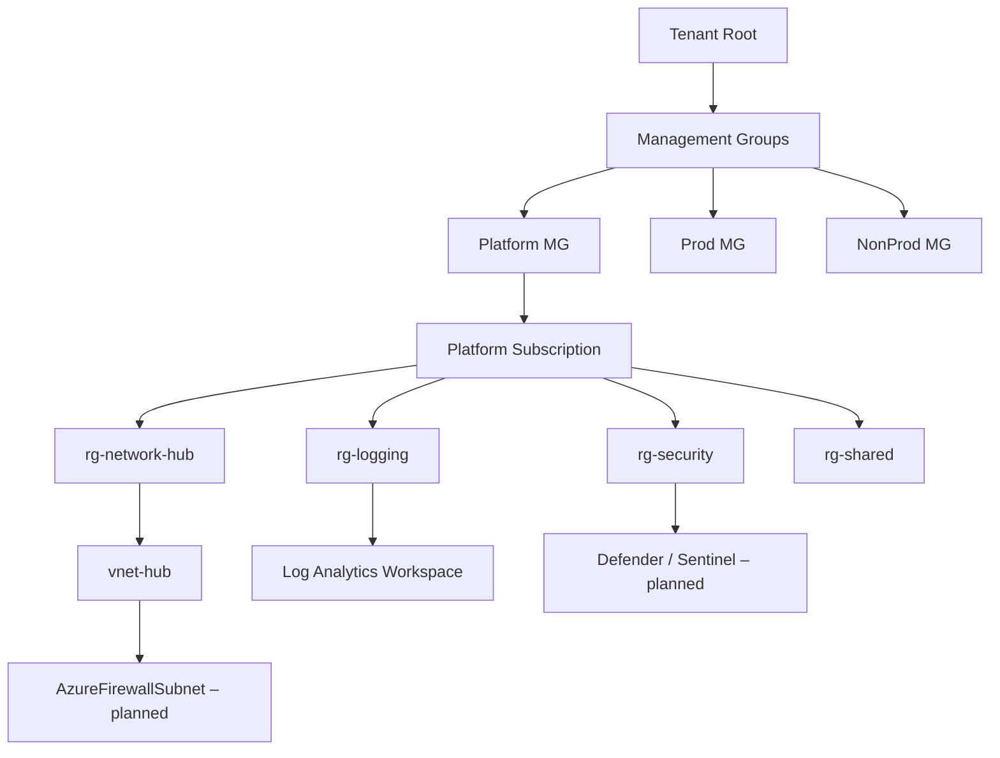
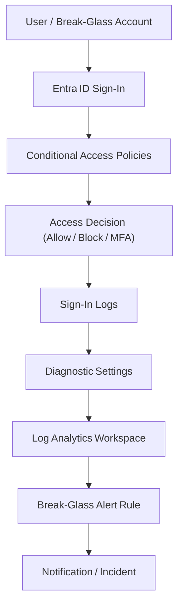

# Azure Landing Zone Lab

## Overview
This lab demonstrates the design and deployment of a **Cloud Adoption Framework (CAF)–aligned Azure Landing Zone** for enterprise security and governance.  
It serves as a practical portfolio project showcasing cloud security architecture, identity management, and monitoring integration.

---

## Current Progress

| CAF Pillar | Status | Notes |
|-------------|---------|-------|
| **Management & Governance** | ✅ Complete | Root, Platform, Prod, and NonProd management groups created. Resource groups structured and tagging policy applied. |
| **Identity & Access** | ✅ Complete | Two break-glass accounts configured with diagnostic logging to Log Analytics. Conditional Access baseline applied. |
| **Networking** | ⚙️ In Progress (~70%) | Hub VNet created. Firewall and policy deployed (later removed to prevent cost). Route tables and peering planned next. |
| **Security** | ⚙️ In Progress (~80%) | Governance policy, Defender integration, and audit logging configured. Security score and compliance policies next. |
| **Monitoring** | ⚙️ In Progress (~80%) | Log Analytics workspace created and connected to identity logs. Expanding to resource and network diagnostics. |
| **Automation (IaC)** | 🚧 Planned | Terraform/Bicep templates to automate Landing Zone deployment. |

**Overall Completion:** ~75%

---

## Key Components Implemented
- **Management Groups:** Root → Platform → Prod / NonProd hierarchy  
- **Resource Groups:** `rg-network-hub`, `rg-logging`, `rg-security`, `rg-shared`  
- **Hub VNet:** Created with `AzureFirewallSubnet`  
- **Firewall Policy:** Deployed and tested, later removed to reduce cost  
- **Governance:** Tag enforcement and baseline policies applied  
- **Log Analytics Workspace:** Centralized logging for sign-in and audit events  
- **Break-Glass Accounts:** Configured with diagnostic settings and monitoring  
- **Diagnostic Settings:** Forwarded to Log Analytics for visibility and audit trail  

---

## Next Steps
1. Rebuild cost-optimized **Firewall and route tables**  
2. Add **spoke VNets** and **peering**  
3. Expand **Defender for Cloud** and **Sentinel integration**  
4. Begin **Terraform automation** for repeatable deployment  
5. Document architecture diagrams and security controls  

---

## Learning Objectives
- Apply **Azure CAF principles** for governance and security  
- Implement **Zero Trust** identity and access controls  
- Configure **centralized monitoring and diagnostics**  
- Build a **portfolio-ready cloud security architecture**

---
  
## Architecture Diagram
This diagram shows the current state of the Azure Landing Zone, including management groups, subscriptions, resource groups, and core networking/logging components.

---

---

## IAM Flow Diagram
This diagram shows how identity authentication events move through Entra ID, Conditional Access, logging, and alerting within the Landing Zone. It includes break‑glass accounts, baseline CA policies, diagnostic settings, and Log Analytics integration.

---

## Author
**Nikola Skendrovic**  
Security Analyst | Cloud Security Engineer  
CCSP Certified | GSEC, GCIH | CompTIA Net+ Sec+ | WGU Cybersecurity Student  

